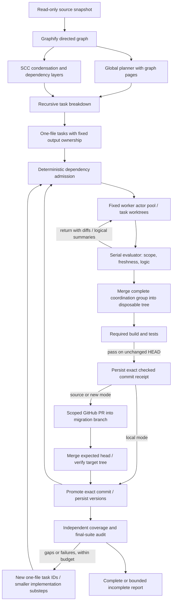

# Architecture and research notes

The model proposes goals, decomposition, code and review judgments. It never controls branch names, accepted versions, write admission, concurrency, test commands, integration promotion, retry caps or completion status. Those are host invariants.

## Loop engineering

Model calls, transient request retries, read/write tool turns, repair returns and replacement rounds are separately bounded. Scope/schema validation is deterministic. A repeated rejected candidate at the same integration version is a no-progress error. A stale candidate can resubmit identical code against new context, because its old review assumptions have changed. The old logical worker stops after exhaustion; replacement work has a fresh ID, branch and model context. There are no persistent remote agent processes to kill.

A fixed worker pool avoids the common cyclic-group deadlock: workers do not hold all slots while waiting for peers that have not generated yet. Submitted artifacts wait on disk. Evaluator/model reviews and Git promotion are serial; unrelated generation can overlap. Concurrency events measure occupied worker actors, not provider GPU scheduling. Whole-group checks prevent partially migrated cycles from reaching integration.

## Context engineering

The global planner uses the raw directed graph, then one-file tasks receive their graph neighborhood, target, global strategy and parent task goals. Versioned source is introduced only to the migration/evaluation roles. Worker context includes prerequisite interfaces, semantic peers and cycle plans. Graph relationships are evidence, not complete semantic knowledge.

The harness sends small files inline and exposes bounded character-offset reads for larger files. It retains a few recent pages and optional cumulative notes. It records supplied-page coverage and rejects premature finalization for assigned source files and evaluator candidate files. Chunked target writes prevent one large final JSON response from being the only output method. Context exceeding configured limits stops explicitly; notes are model summaries and cannot establish equivalence.

After integration changes, a worker gets changed paths, actual Git diffs and summaries of accepted changes. Every candidate is tied to a context commit and target preimage hashes. Invalidation considers the whole integration tree, since runtime/config/data contracts may couple files without import edges. This conservative policy can cause repeated refreshes on broad parallel workloads; narrower semantic invalidation is future work that requires evidence from contract/change-impact tests.

## Harness engineering

A run owns its Git repository, worktrees, SQLite journal and destination lock. Critical JSON files are atomically replaced and synced; authoritative task definitions, rounds and attempt reservations are persisted in SQLite. Resume cannot reset an exhausted identity’s retry count. Orphan task checkouts and missing JSON task projections are recoverable. Checks happen on a disposable checkout; promotion uses the exact tested Git commit. Source hashes are immutable inputs and target hashes update only after acceptance. Receipts reconcile promotion with database state after crashes. Candidate revisions and Git submission refs retain rejected evidence. Temporary check/audit worktrees are removed; task worktrees remain for inspection.

The source inventory is independent of Graphify, so extraction misses cannot disappear from the final accounting. Included files must have accepted output ownership. Binary/empty assets are copied deterministically. Final build/test failures yield owner-scoped repair tasks. Source/config changes, invalid ownership, provider failure, exhausted budgets or unresolved checks result in incomplete status.

Configured local checks can execute arbitrary program behavior. Optional Docker execution limits network, filesystem reach and resources; stronger isolation and trusted external test fixtures are required for hostile code. The model cannot emit shell commands for the host. Docker is provisioned separately; lack of an image is a failure, not a reason to fall back to host execution.

## GitHub publication

`repository.mode: source` derives the destination from source origin and forks its remote base into a new migration branch. Translated files occupy a dedicated empty directory; original source remains present. `mode: new` uses the configured GitHub URL and optionally creates a missing repository, private by default. Both modes preserve the original base branch. With no repository configuration, the existing local integration flow applies.

The publisher receives the evaluator's exact checked commit and disposable checkout. It copies only the approved output paths into a run-owned remote clone, then requires the entire translated subtree's Git tree ID to equal the checked local tree. It opens a PR into the migration branch, verifies the PR head/base and unchanged remote base, and merges with `--match-head-commit`. It does not bypass protection or enable delayed automatic merges. The actual merged subtree and merge ancestry are checked before local acceptance; final completion also compares the remote branch with the fully audited local tree. These checks use [GitHub CLI merge semantics](https://cli.github.com/manual/gh_pr_merge).

Remote publication is serial and cycle groups publish atomically. Transactions identify task IDs plus the full target tree, retaining equivalent checked-commit identities to avoid duplicate PRs during retries. Durable receipts precede publication; on resume, a merged PR can promote the retained checked commit and recover journal acceptance after a crash. An open or rejected PR supplies no acceptance proof. Concurrent external changes fail the remote checks; automatic incorporation of unrelated remote edits and hosted merge queues are not implemented.

## Research basis and boundaries

The separation of context selection, bounded tools and state outside conversation follows the practical principles described in Anthropic's [context engineering article](https://www.anthropic.com/engineering/effective-context-engineering-for-ai-agents). Durable progress records, incremental tasks and explicit verification are consistent with its [long-running agent harness article](https://www.anthropic.com/engineering/effective-harnesses-for-long-running-agents). These are design guidance, not evidence that Hensei is correct.

Provider errors are handled using [DeepSeek's documented error classes](https://api-docs.deepseek.com/quick_start/error_codes/). Docker options are grounded in the [official run reference](https://docs.docker.com/reference/cli/docker/container/run/). Source versions and whole-tree invalidation are conservative design choices made here; they are not a claim of complete semantic analysis.

For an FYP paper, compare single-agent, dependency-unaware parallel, graph-guided parallel, and graph-guided + evaluator/recovery variants on the same repositories and target toolchain. Use real compilation success, original/translated behavioral tests, differential outputs, accepted file coverage, repair counts, merge conflicts, API tokens/cost, wall time and restart recovery. Repeat with fixed model/configuration and record variance. Separate the synthetic scheduling benchmark from full translation quality. A million-line inventory benchmark does not establish a million-line migration result.

## Verification recorded on 2026-10-07

The automated suite includes 59 passing tests and TypeScript checks. A local synthetic run inventories 1,000 files containing 1,000,000 function-definition lines (37,780,000 bytes), with a generated file graph; it does not exercise Graphify or model translation. The files were freshly written, so this is a warm-cache measurement.

A real DeepSeek planning run over `examples/cyclic` produced five schema-v2 tasks, each owning one source file, with the two cycle files in one coordination group. After switching networks, the previously interrupted local run resumed to 100% included-file coverage with passing Bun compilation and configured behavioral checks. A fresh GitHub-enabled run then completed all five tasks, observed two concurrent workers within its configured cap of two, returned one stale candidate, and merged four real PRs. The cyclic pair was published together in [PR #3](https://github.com/git-sudo-404/Hensei/pull/3); the final integration is on [its migration branch](https://github.com/git-sudo-404/Hensei/tree/hensei/live-cyclic-1791364513972/migrated/cyclic). This TypeScript-to-TypeScript fixture tests orchestration and cyclic integration, not cross-language translation.

A fresh Graphify-to-planner-to-executor run migrated the single JavaScript source file in `examples/evaluation/source` to TypeScript with an explicitly owned tsconfig. The initial test run remained incomplete after network failures and malformed output. Planning prompts were corrected to produce implementation assignments. The subsequent run recovered another connection reset through a fresh follow-up task, reached 100% included-file coverage, passed its compilation and numeric behavioral checks, and merged [PR #5](https://github.com/git-sudo-404/Hensei/pull/5). This is a small cross-language fixture; it does not establish production-scale migration quality.

Resuming that completed JavaScript run repeated the final audit successfully, without generating another candidate or another PR. All five live PRs targeted their dedicated migration branches; none targeted `main`.

Automated tests use injected scripted completions and real Git/build/test processes. GitHub publication tests exercise real local/bare Git repositories with a scripted GitHub transport, including private empty-repository initialization, refused merges, exact target-tree matching, duplicate-publication prevention and evaluator recovery after remote merge but before local acceptance. Live GitHub testing used source-repository mode; separate repository creation is covered by the scripted transport tests, not a live repository-creation experiment. Docker argument restrictions are tested, but a Docker daemon run is unverified.

The provider adapter disables connection reuse and retries body-read transport failures as well as initial connection failures. This uses [Bun's documented fetch options](https://bun.sh/docs/runtime/networking/fetch). DeepSeek calls now succeed on the available connection, but intermittent resets were still observed; bounded recovery succeeded in the final JavaScript fixture run.
